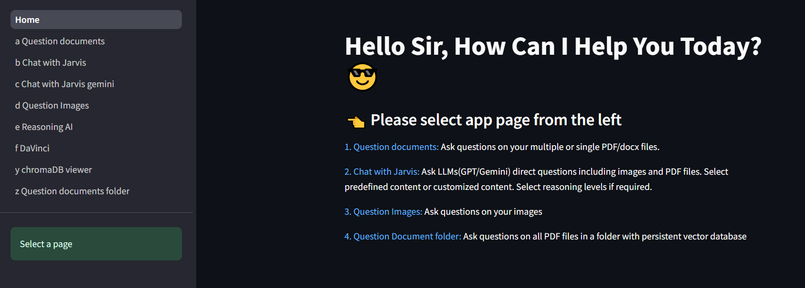
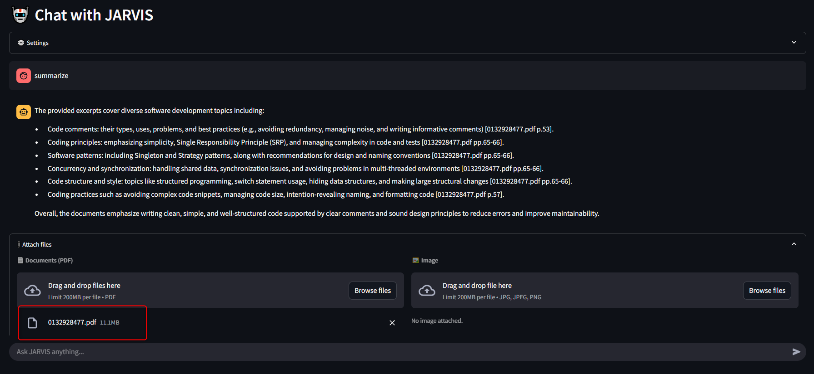
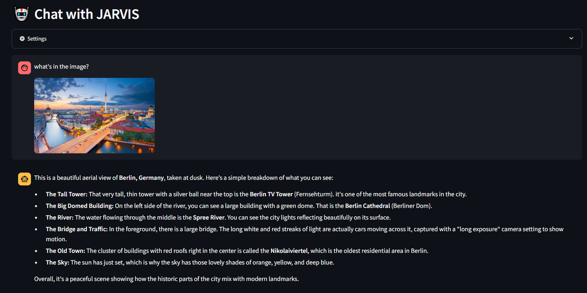
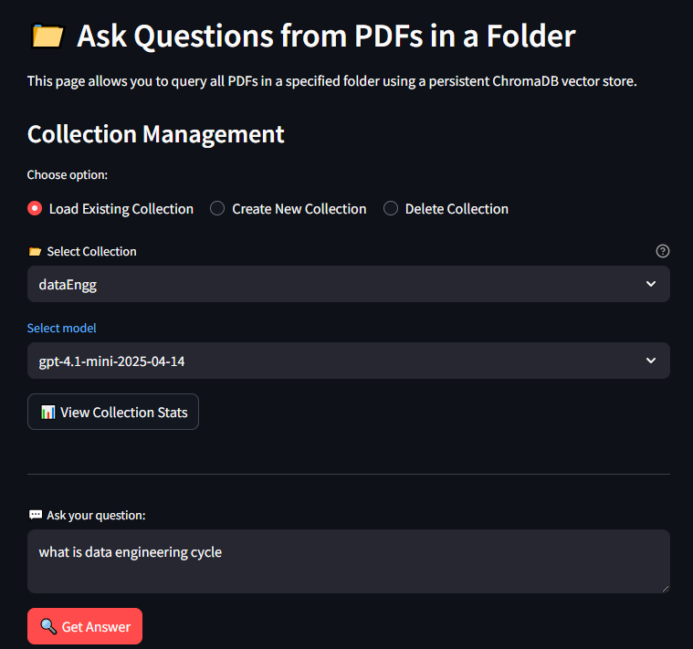
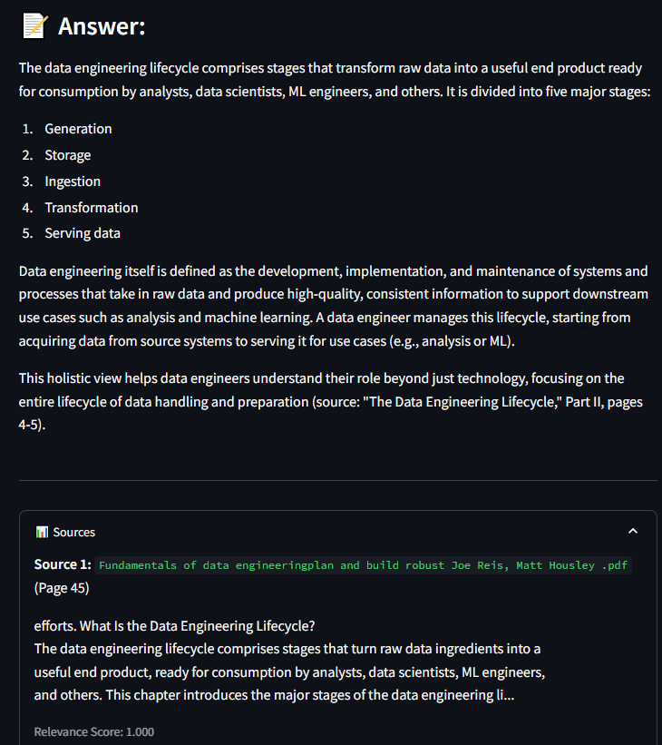

# Multi page LLM App

# Chat with JARVIS 
- Available models: GPT/Gemini, easy to update new models. 
- Select among available content or type your own content
 

# pdf_QA / Image QA (RAG)
- To get Answers to questions from a pdf
- Has memory

Question Images

#  RAG on folders with documents- create and load knowledge base

#### Get Answers along with the sources 

