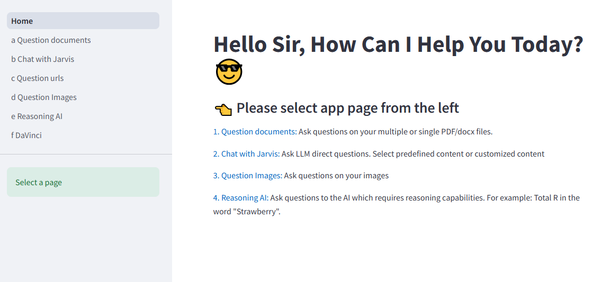
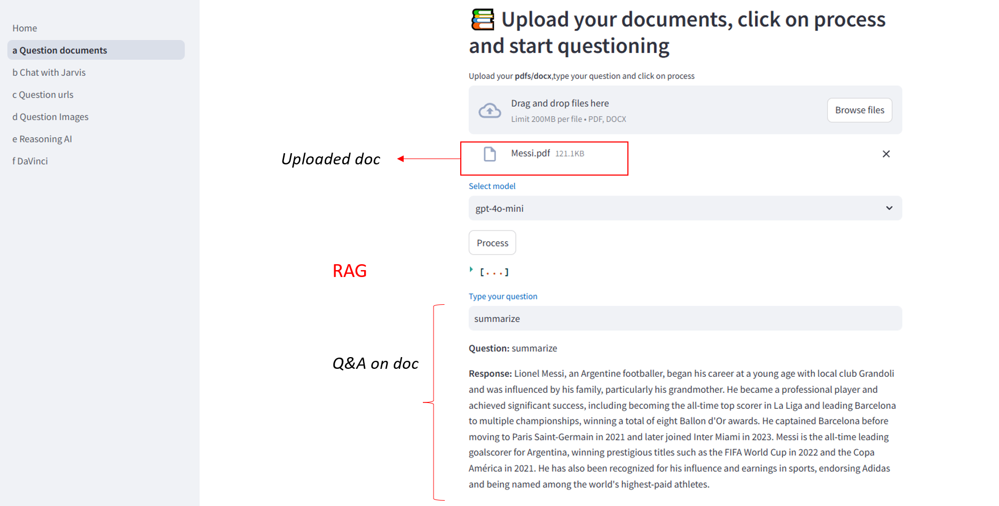
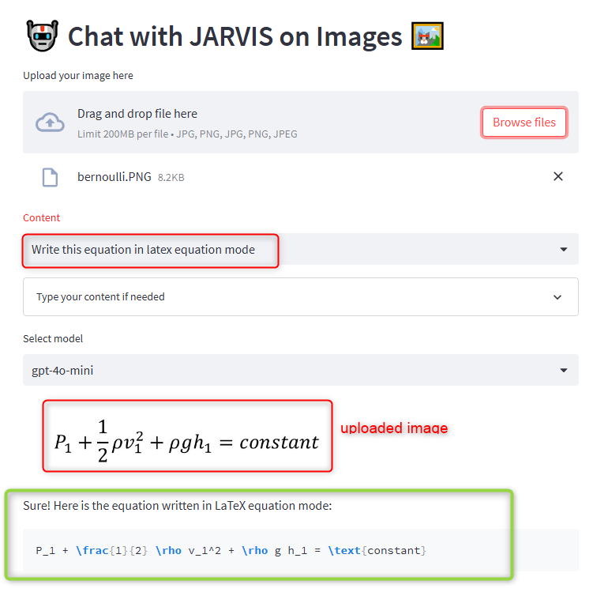

# Multi page LLM App

# pdf_QA (RAG)
- To get Answers to questions from a pdf
- Has memory

# Chat with JARVIS 
- Available models: gpt-5, gpt5-mini, gpt4.1, gpt4.1-mini, easy to update new models. 
- Select among available content or type your own content
  

# Chat with JARVIS on Images 
- Question Images

- Question Images

Image related info 
https://platform.openai.com/docs/guides/vision

